# 👋 Hello World! I'm Turki Altasan

💡 **Data Analyst** | Skilled in **SQL**, **Python**, **Excel**, **Power BI**, **Tableau**, and **Looker**  
🎯 Passionate about turning data into actionable insights

I enjoy analyzing datasets, building interactive dashboards, and transforming raw data into meaningful insights using tools like Python, SQL, Power BI, and Excel.  
My goal is to grow as a data analyst, contribute to impactful business decisions, and continuously improve my technical and analytical skills.

---

## Skills & Technologies 🚀

### 📊 Data Analysis

### 📈 Visualization

---

## SKILLS 🤹🏼

###

• Data Cleaning. • Data Visualization. • Data Analysis. • Programming (Java, C#, C++). • Statistical Analysis.   • Analytical Thinking. • Critical Thinking. • Project Management. • Microsoft Office. • Problem Solving. • Responsibility. • Teamwork.

###

---

###

## Connect with Me 📩

###

  
  
  

###

---

###

<h2 align="center">✨ Highlights of my Data Analysis Projects:</h2>

###

  

###

<h2 align="center">1. A Comprehensive Sales and Performance Dashboard - Data Analysis</h2>

In this analysis, <strong style="font-size:18px;">#Power BI 💻</strong> was used to analyze data 🎯 extracted from Kaggle, with the aim of studying sales performance and understanding customer behavior more deeply with track of sales Rep target. 
This project aimed to transform raw data into interactive Power BI dashboards that provide a 360° view of sales and operational performance. It goes beyond basic sales tracking to uncover insights on profitability, customer behavior, regional performance, and product efficiency.

<h3>Project Highlights:</h3>
<ul>
<li>Built 8 interactive dashboards covering sales, customers, products, regions, and representatives.</li>
</ul>

<h3>Key Metrics:</h3>
<ul>
<li>Net Sales: 5.00M SAR (104.27% of target)</li>
<li>Profit: 252K SAR (5.05% margin)</li>
<li>Customers: 2.84K (50.4% new, 49.6% returning)</li>
<li>Coverage: 4 regions (North, East, West, South)</li>
</ul>

<h3>Advanced Insights:</h3>
<ul>
<li>Time-series and geographic analysis to track trends and regional growth.</li>
<li>Product and customer analysis to identify top-performing items and buying behavior.</li>
<li>Decomposition Tree for detailed, step-by-step performance exploration.</li>
</ul>

<h3>Business Value:</h3>
<ul>
<li>Delivers a full performance overview across departments.</li>
<li>Supports strategic decision-making with data-driven insights.</li>
<li>Highlights strengths, growth opportunities, and customer loyalty trends.</li>
</ul>

###

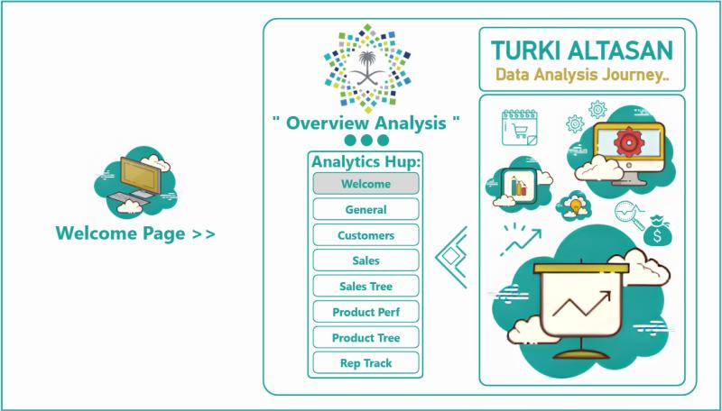 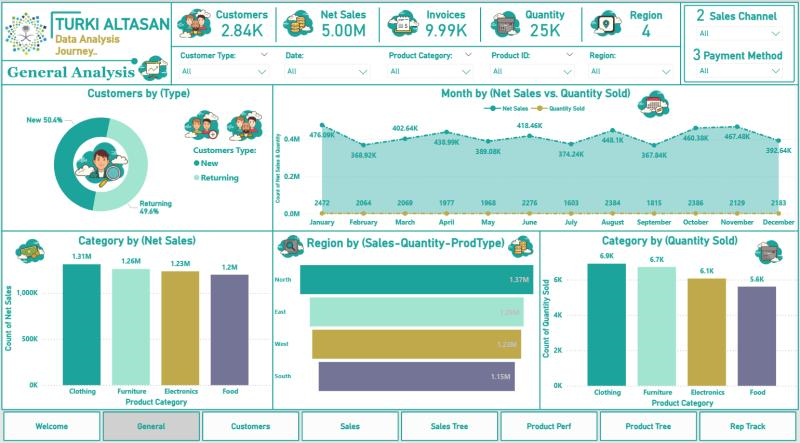 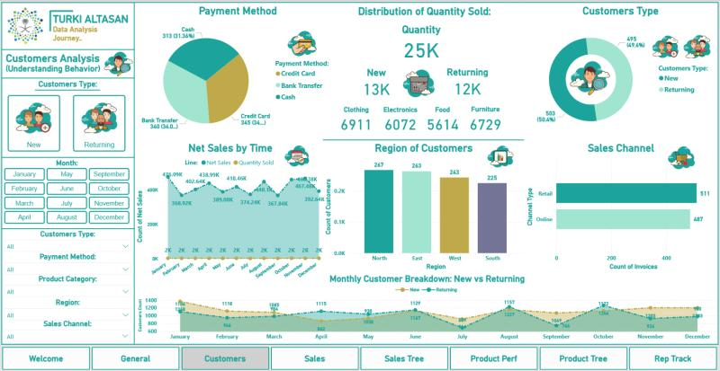 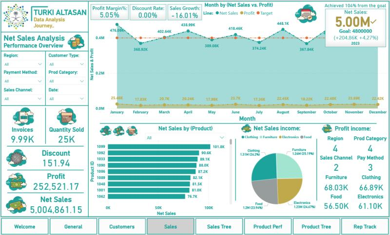 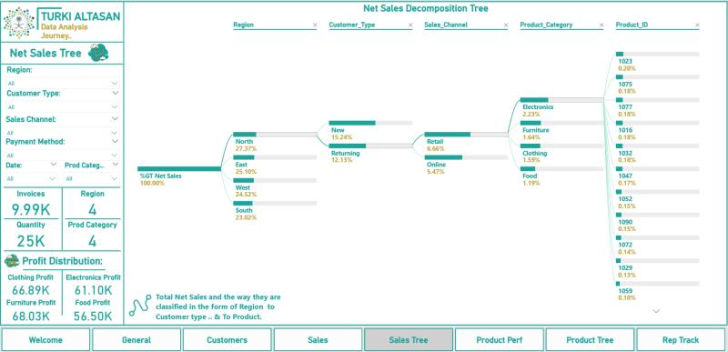 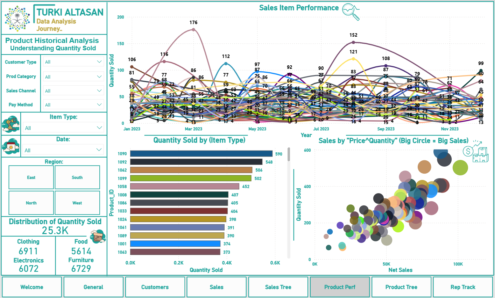 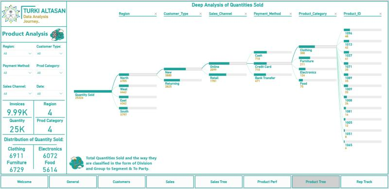 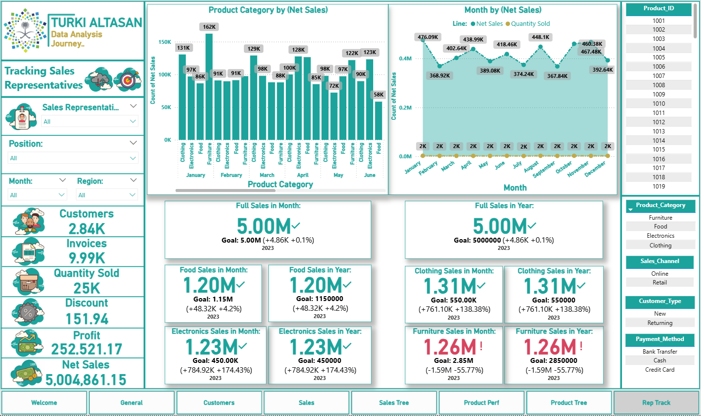

###
---

<h2 align="center">2. Analyzing Sales, Customers, and Point of Sale Performance - Data Analysis</h2>

In this analysis, <strong style="font-size:18px;">#Power BI 💻</strong> was used to analyze data 🎯 extracted from Kaggle, with the aim of studying sales performance and understanding customer behavior more deeply.

<h3>Key Findings:</h3>
<ul>
<li>Category of customers by purchasing behavior and geography.</li>
<li>Identification of the most selling and profitable product lines.</li>
<li>Analyzing payment methods and financial performance of each branch.</li>
</ul>

<h3>Business Value:</h3>

This analysis helped provide clear insights to support strategic decision-making, such as improving membership programs, investing in the most in-demand products, and developing financial policies.

###

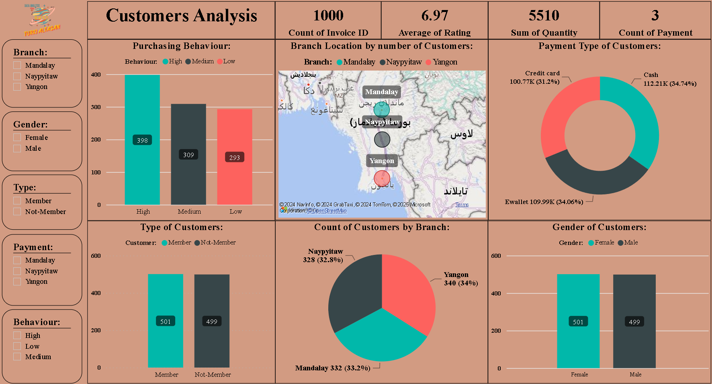 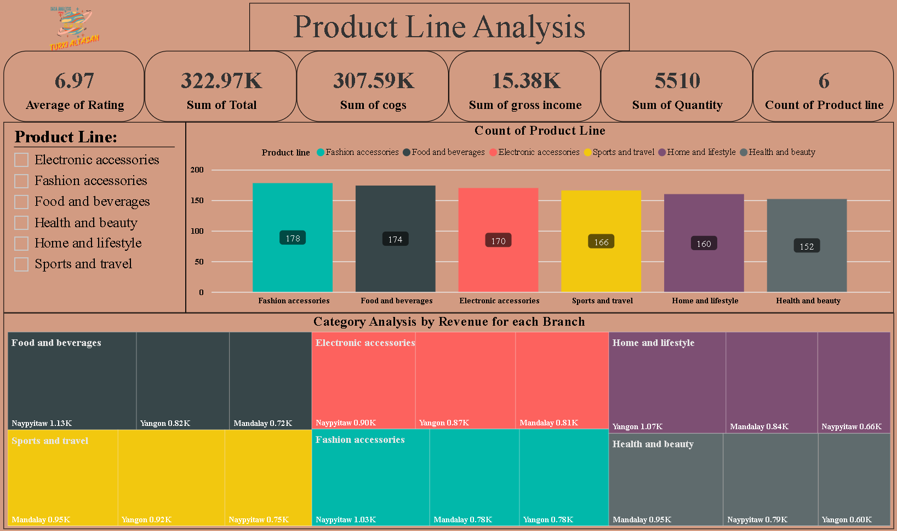 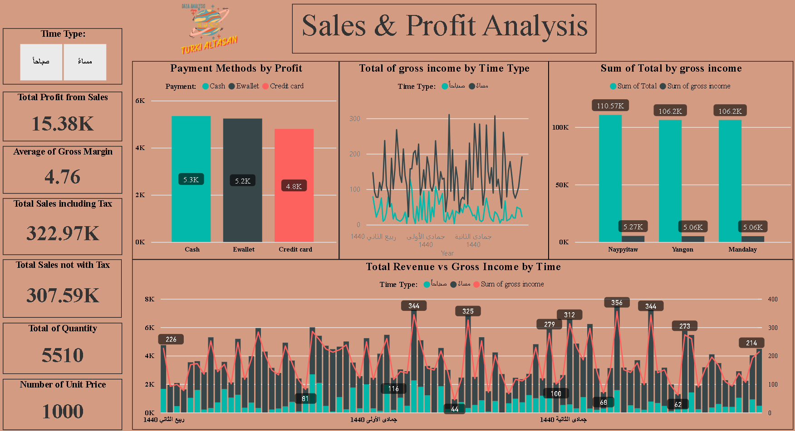 

###
---

<h2 align="center">3. Customer Performance Analysis for a Store Website - Data Analysis</h2>

The data was analyzed, cleaned, and organized using 
<strong style="font-size:18px;">#SQL 🎯</strong> through 
<strong style="font-size:18px;">#BigQuery</strong>, and the results were visualized using 
<strong style="font-size:18px;">#Power BI 💻</strong>.

<h3>Project Overview:</h3>

This analysis project provides a comprehensive view of customer demographics, purchase preferences, and sales distribution across categories and brands, helping inform targeted marketing and product strategies.

###

###
---

<h2 align="center">4. Tharwa Bank – Data Analysis</h2>

We aimed to boost customer retention and reduce churn rate for Tharwa Bank. Using 
<strong style="font-size:18px;">Google #BigQuery</strong>, 
<strong style="font-size:18px;">#SQL 🎯</strong>, and 
<strong style="font-size:18px;">#Looker Studio</strong> & 
<strong style="font-size:18px;">#Power BI 💻</strong>, 
we performed data-driven analysis to enhance performance and engagement.

###

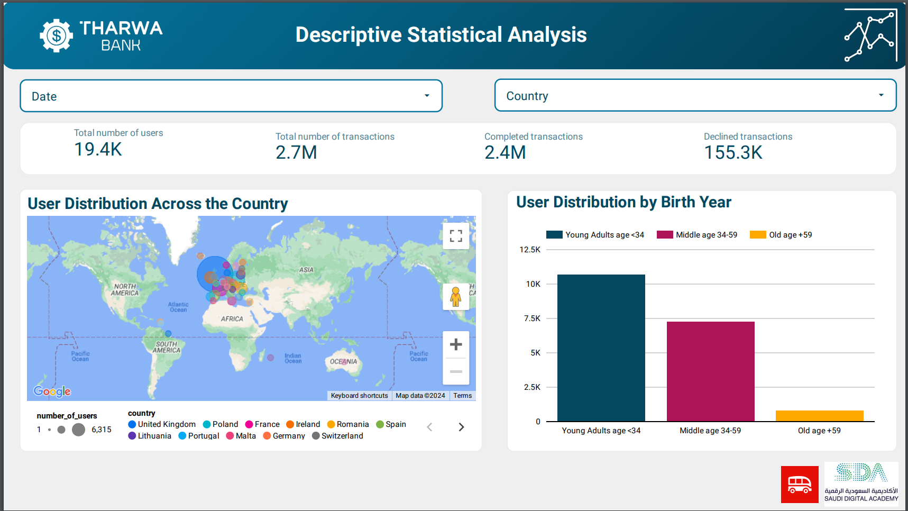 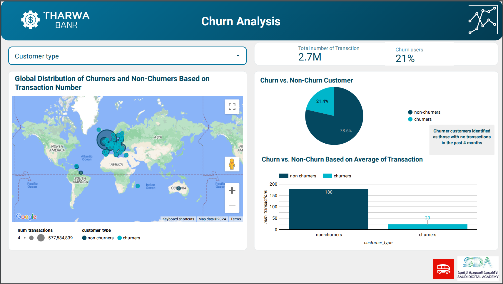 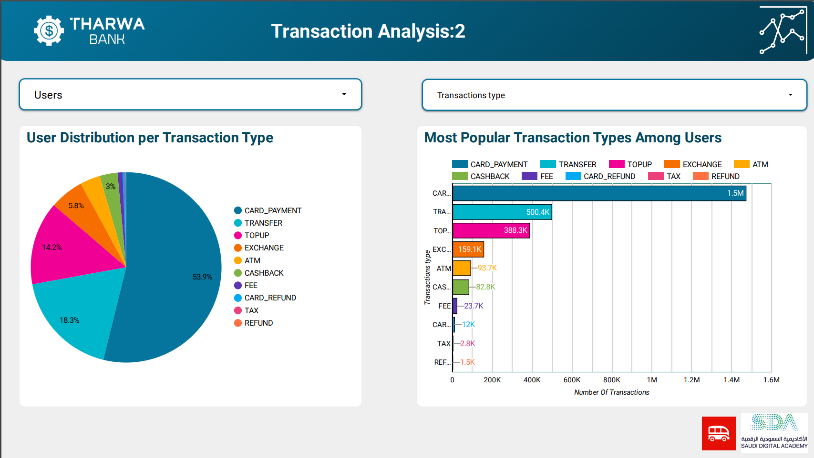 

###
---

<h2 align="center">5. Graduation Project: Computer Science</h2>

Graduation Project was developed using 
<strong style="font-size:18px;">#Python 🎯</strong> with the <strong>tkinter</strong> library for creating a graphical user interface.

<h3>Project Aim:</h3>

The project's aim is to verify users based on their voices and different sound wave patterns.

###

 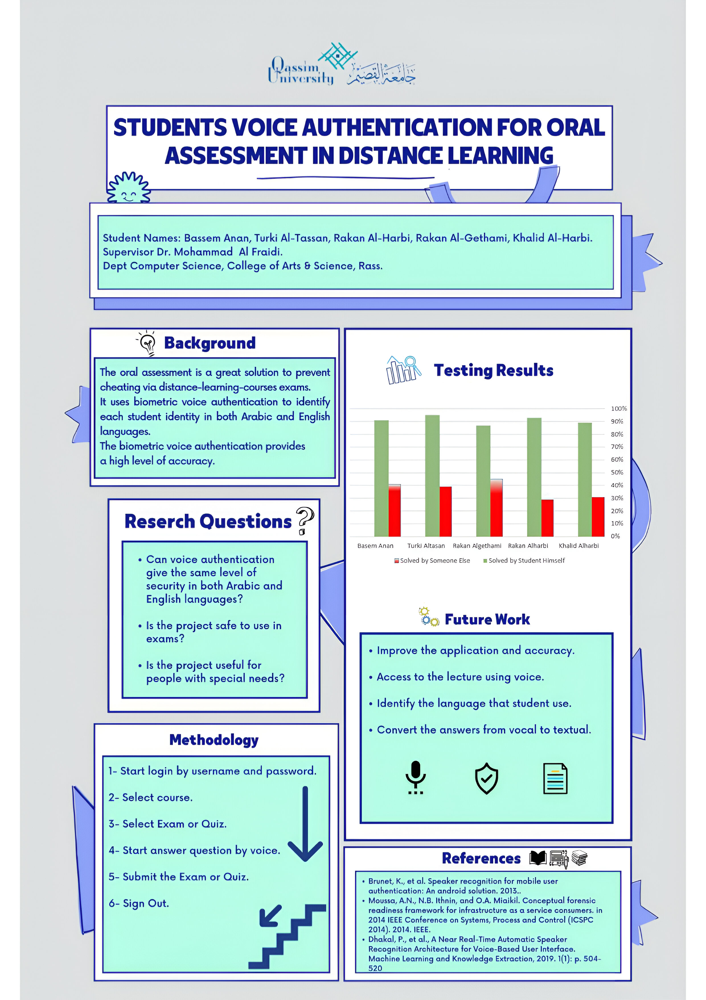 

###

---

###

<h2 align="center">"📚 My Certifications: "</h2>

###

  

###

<h4 align="center">🗂️ BootCamp: ☑️Data Analysis. By [Saudi Digital Academy (SDA) & Le Wagon] Tools we use: SQL & Python & Excel & Google BigQuery & Tableau & Power BI & Looker & Zapier & dbt & Git & APIs & Google Analytics & Google Tag Manager Graduated at: 05/2024</h4>

###

<h4 align="center">☑️CompTIA Data+ By CompTIA.</h4>

###

<h4 align="center">☑️Data Science & Artificial Intelligence Track By Satr Educational Platform & Tuwaiq Academy.</h4>

###

<h4 align="center">☑️Google Advanced Data Analytics By Google & Coursera.</h4>

###

<h4 align="center">☑️Membership Category: Specialist Specialization: Computer Science. Membership number: 1009484 By Saudi Council of Engineers.</h4>

###
---

<h1 align="center">Thank you for visiting! 🤍</h1>

###
